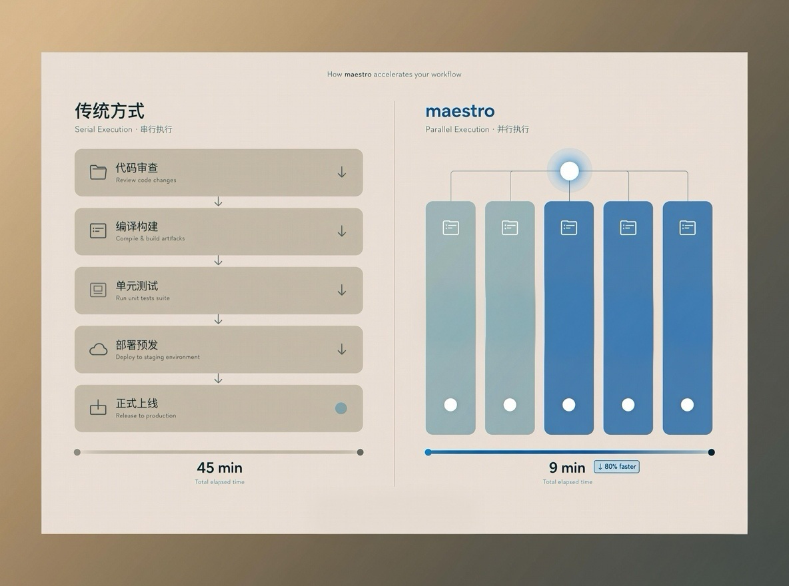

# 🎼 claude-code-maestro

[中文](README.zh.md) | **English**

> A multi-agent orchestration framework for Claude Code — enforces your coding agreements through system-level hooks, not prompts.

**Sound familiar?**

- Tests all passed, but bugs showed up in production — because Claude wrote tests *against* its own implementation, not against your requirements
- You defined coding standards at the start, but Claude quietly stopped following them as the session grew
- The more complex the requirement, the more Claude "improvises" — touching things it shouldn't, and you have no idea what changed
- Multiple modules queue up and run one at a time, even though they could all run in parallel
- A session gets interrupted — and you have no idea where it left off

The root cause is always the same: existing solutions put rules in prompts and rely on Claude's self-discipline. As context grows, the rules fade.

**maestro works differently: rules aren't remembered by the model — they're enforced by the system.**

Three things no other tool does:

**① Quantified workflow**
Requirements are broken into discrete units by `analyst-agent`, confirmed with you, and locked. Not Claude improvising — a structured boundary you approved.

**② Independent units run in parallel**
`orchestrator` uses a dependency graph to schedule execution. Units with no dependencies run simultaneously — 10 modules don't queue, they run at once. The bigger the requirement, the bigger the advantage.



**③ Agreements are enforced. Test results are trustworthy.**
Every convention agreed upon during `/harness-init` — test requirements, coding standards, security checks — gets written into Hook scripts. Any write operation is intercepted and validated before it executes. Claude cannot bypass it. Test cases are generated and locked *before any implementation exists*, so they can never be retrofitted to match the code.

→ [Get started in 5 minutes](#quick-start)

---

## See it in action

**Without maestro**: You hand Claude a complex requirement. It breaks working logic along the way, or writes tests that only pass its own implementation. When something goes wrong, you can't tell which step caused it.

**With maestro**:

```
/analyst-agent   # Describe the requirement, break it into units, confirm with you
/orchestrator    # Parallel dev + testing + standards check, fully automatic
```

Then grab a coffee.

---

## Under the Hood

```
Your requirement description
        ↓
/analyst-agent  →  Unit boundary document (confirmed and locked by you)
        ↓
/orchestrator
  ├── test-agent (parallel)       Generates test cases from requirements — no implementation exists yet
  ├── dev-agent (parallel by DAG) Implements each unit — can only make tests pass, cannot modify them
  ├── test-agent (parallel)       Runs immediately after each unit completes
  ├── interface-test-agent        Auto-triggered when HTTP endpoints are present
  └── review-agent                Runs standards checks defined in /harness-init after all units pass
```

Each agent only receives the information `orchestrator` explicitly passes in. Nothing more. No self-discipline required.

---

## Quick Start

### Step 1: Install

```bash
git clone https://github.com/SilentDawnAndDarkCrow/claude-code-maestro.git
cd claude-code-maestro
./install.sh
```

Restart Claude Code. All three skills are ready to use.

### Step 2: Initialize your project

Open Claude Code in your project directory (works with both new and existing projects):

```
/harness-init
```

Answer a few questions (tech stack, directory structure, quality tools). It generates:

- `CLAUDE.md` — project standards master file
- `.claude/rules/` — coding / testing / security specifications
- `.claude/hooks/` — task gates + quality check hooks (the enforcers of every agreement)
- `.claude/skills/dev-agent/`, `.claude/skills/review-agent/` — in-project sub-agents

### Step 3: Describe your requirement

```
/analyst-agent
```

Describe what you want to build in plain language. `analyst-agent` breaks it into independent business units. After you confirm, it's saved to `upgrade_plan/v{VERSION}/requirement_analysis.md` (version number is auto-incremented per run).

### Step 4: One command to build

```
/orchestrator
```

Parallel coding, testing, interface validation, standards checks — fully automatic. Interrupted runs resume from where they stopped.

---

## Requirements

- [Claude Code](https://claude.ai/code) installed, with support for the `Skill` and `Agent` tools (requires Max or Pro plan)

---

## License

[CC BY-NC 4.0](LICENSE) — Free to use and modify, no commercial use.
